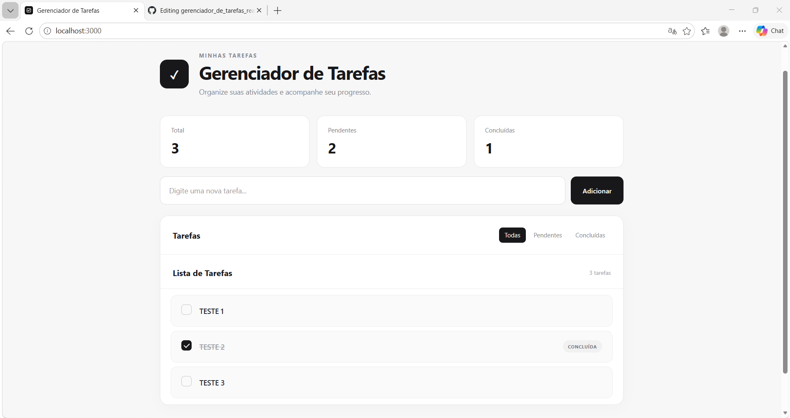
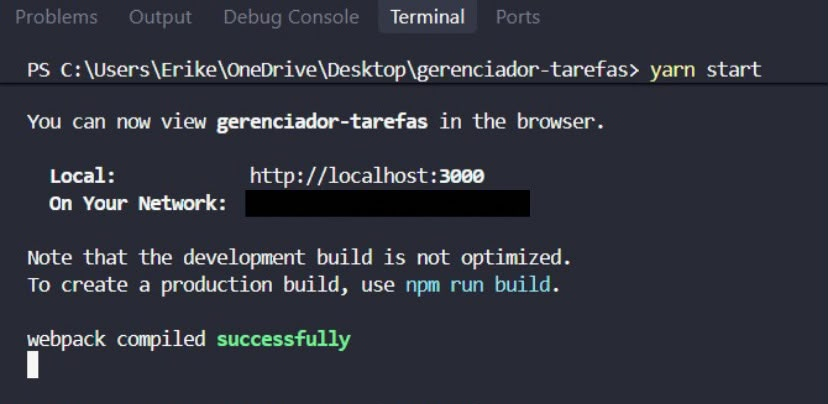

# Gerenciador de Tarefas React

Projeto acadêmico desenvolvido em **React JS** para a disciplina **Linguagem de Programação para a Internet**, da **Universidade de Uberaba (UNIUBE)**.

A aplicação permite **adicionar tarefas, marcar como concluídas e filtrar por status**.

## Aplicação



## Execução



## Tecnologias utilizadas

- **React JS**
- **Node.js**
- **JavaScript**
- **HTML5**
- **CSS3**
- **Context API**
- **useState**
- **useReducer**
- **Git e GitHub**

## Estrutura do projeto

```text
gerenciador-tarefas/
│
├── public/
│   ├── favicon.png
│   ├── index.html
│   ├── manifest.json
│   └── robots.txt
│
├── src/
│   ├── App.js
│   ├── App.css
│   ├── ContextoTarefas.js
│   ├── index.js
│   ├── ListaDeTarefas.js
│   ├── ListaDeTarefas.css
│   ├── Tarefa.js
│   └── Tarefa.css
│
├── .gitignore
├── package.json
├── package-lock.json
└── README.md
```

## Como executar

Instale as dependências:

```bash
yarn
```

Execute a aplicação:

```bash
yarn start
```

Acesse no navegador:

```text
http://localhost:3000
```

## Funcionalidades

- Adicionar novas tarefas
- Marcar tarefas como concluídas
- Visualizar todas as tarefas
- Filtrar tarefas pendentes
- Filtrar tarefas concluídas
- Gerenciamento de estado global com Context API e useReducer
